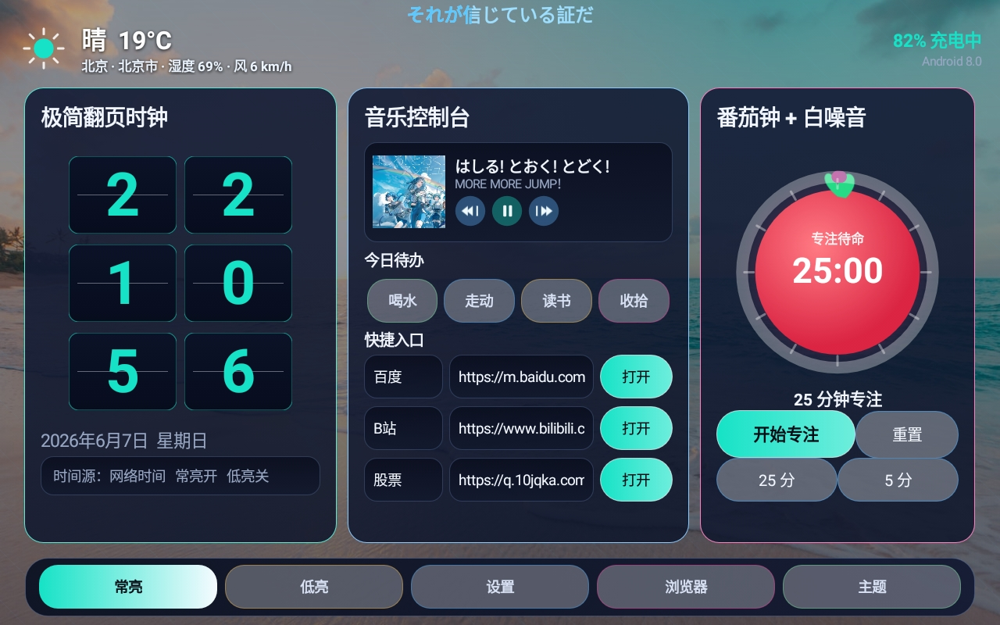
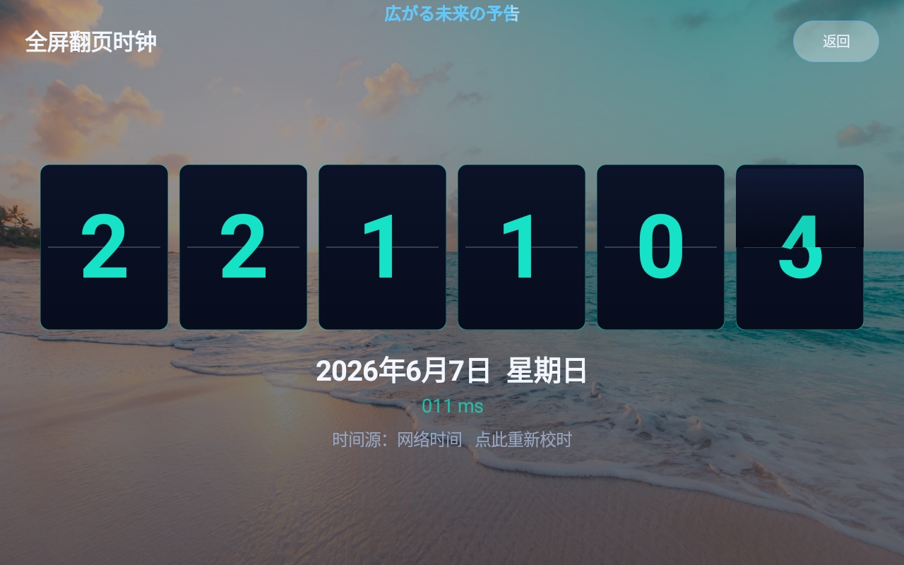
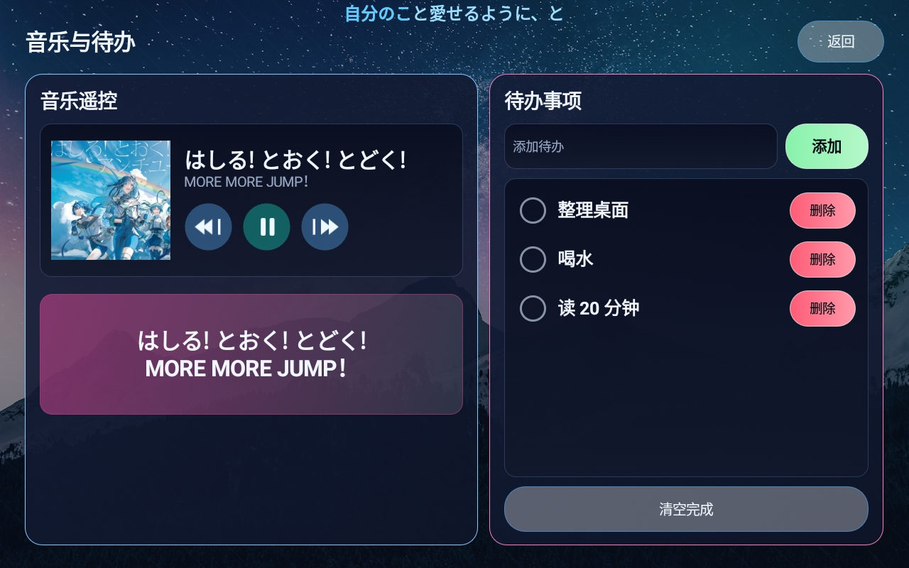
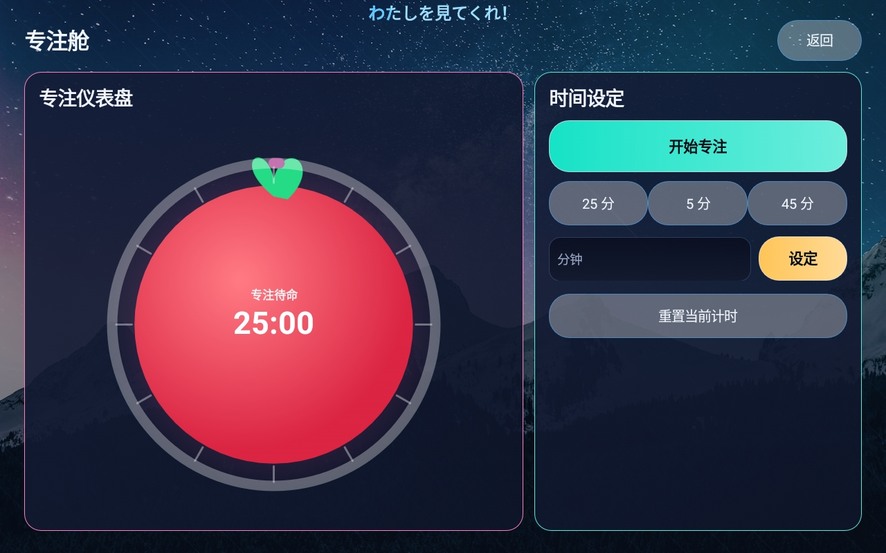

# 平板智能时钟：旧安卓平板桌面工具

平板智能时钟是给旧安卓平板/旧手机做的桌面与常驻屏应用，最初适配 Lenovo TAB E8 3+32G、Android 8.0。平板和横屏设备更适合它，但手机也能用。它把跑不动新版微信、QQ 的旧设备改造成一个专用屏：大字翻页时钟、天气、番茄钟、音乐控制台、待办事项、常用网页入口，以及一个能刷网页、看视频的内置微型浏览器。

## 下载 APK

当前版本：**v1.1**

- [平板智能时钟.apk](outputs/%E5%B9%B3%E6%9D%BF%E6%99%BA%E8%83%BD%E6%97%B6%E9%92%9F.apk)
- [ReviveBoard.apk](outputs/ReviveBoard.apk)

安装后应用名显示为 **平板智能时钟**。如果想把它当主屏幕使用，可以在 Android 的默认桌面设置里选择平板智能时钟。手机也能安装，只是小屏竖屏下更适合当备用时钟、音乐遥控或轻量浏览器。

## 界面预览

### 主页



### 点击卡片后的详情页

| 全屏翻页时钟 | 音乐与待办 | 专注番茄钟 |
| --- | --- | --- |
|  |  |  |

## 功能

- 大字翻页时钟，支持网络时间校时，离线时回退系统时间
- 实时天气，支持城市搜索，例如北京、福州、泉州、厦门等
- 番茄钟和白噪音，到时间弹窗提醒
- 音乐控制台，通过 Android 媒体会话/通知栏读取歌名、歌手、专辑图和播放状态
- 待办事项，支持添加、勾选完成、删除和清空完成
- 内置微型浏览器，支持地址栏搜索、分页、收藏夹、页面缩放、桌面/移动模式、夜间模式、清理缓存和网页视频全屏
- 快捷入口，默认百度、B站、抖音
- 常亮、低亮、主题背景切换
- 可作为 Android HOME 桌面应用

## v1.1 更新

这一版把“网页入口”往前推了一步。应用内现在带微型浏览器，旧平板不用再额外打开一个大浏览器，也能完成基础娱乐：搜网页、看 B 站或短视频页面、打开收藏、切分页、调页面缩放。

浏览器打开时，主屏时钟、天气、音乐轮询会降下来，减少旧设备播放视频时的卡顿。分页缩略图只存在内存里，关闭分页、退出浏览器或退出应用时会清理。

## 权限说明

- 位置权限：用于天气城市和实时天气。
- 通知使用权：用于读取系统音乐通知里的歌名、歌手、专辑图和播放状态。
- 辅助功能服务：用于读取部分音乐通知/歌词文字；不需要时可以不开。
- 网络权限：用于天气、网络校时和内置浏览器。

## 适合谁

适合 Lenovo TAB E8、老安卓平板、旧手机、备用屏、床头钟、学习番茄钟、厨房屏、家庭留言屏、老人常用网页入口、局域网控制屏等场景。更推荐用在平板、横屏手机或能长期插电的备用设备上。

它不是为了替代新版微信、QQ 或完整浏览器，而是把旧设备变成一个安静、固定、可用的专用屏幕。

## 源码位置

主源码：

```text
work/ReviveBoard/src/com/codex/tabe8revive/MainActivity.java
```

资源文件：

```text
work/ReviveBoard/res/
```

APK 输出：

```text
outputs/平板智能时钟.apk
outputs/ReviveBoard.apk
```

## 构建说明

这个项目是原生 Java Android 项目，目前使用本地 Android SDK 手动构建，不依赖 Gradle。开发机上使用的 SDK 在 D 盘，避免占用 C 盘空间。

关键工具包括：

- `aapt2`
- `javac`
- `d8`
- `zipalign`
- `apksigner`

Android 最低版本设置为 API 23，目标版本为 API 26，方便旧设备安装运行。

## 关键词

平板智能时钟、旧平板复活、旧手机再利用、安卓旧平板、安卓旧手机、Lenovo TAB E8、Android 8、翻页时钟、番茄钟、天气桌面、音乐控制台、待办事项、内置浏览器、微型浏览器、网页视频、平板桌面工具。
